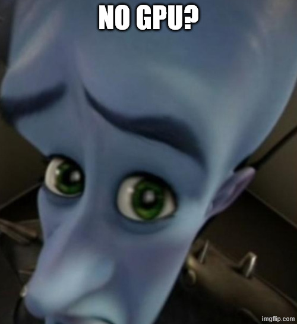

# MotorUnitSuite

This Repo serves both as a Tutorial/Onboarding, and as a minimal tool for decomposition experiments, containing most of what is commonly necessary to decompose the various signals we will encounter in the scope of our work.

The recording and full decomposition pipelines are in the PatientGUI Repo: as we move into doing more and more Patient work however, I would like to use that repo as a stable tool, with minimal changes to its frontend and backend, as bringing an in development tool into an hospital room is at best stupid and at worse harmful (It is also what I have been doing this entire time).


- [MotorUnitSuite](#motorunitsuite)
- [Installation](#installation)
  - [What you need first](#what-you-need-first)
  - [1. Clone](#1-clone)
  - [2. Create the environment](#2-create-the-environment)
  - [3. Verify CUDA actually works](#3-verify-cuda-actually-works)
  - [Manual environment (non-Windows, or if the solve fails)](#manual-environment-non-windows-or-if-the-solve-fails)
  - [No GPU?](#no-gpu)
  - [A note on imports](#a-note-on-imports)
- [Start Here](#start-here)
- [Repository Structure](#repository-structure)
- [Git Hygiene](#git-hygiene)

# Installation

## What you need first

- **Miniconda / Anaconda** ([miniconda](https://docs.conda.io/en/latest/miniconda.html) is enough)
- **Git**
- An **NVIDIA GPU + driver** if you want CUDA. You should *not* need to install the CUDA Toolkit yourself: conda pulls the CUDA 11.8 runtime as part of the environment. You only need a driver recent enough for it (≥ 522.06 on Windows, ≥ 520.61 on Linux). Check by running `nvidia-smi` in a terminal.

## 1. Clone

```bash
git clone https://github.com/neuroenglab/MotorUnitSuite.git
cd MotorUnitSuite
```

## 2. Create the environment

The environment is called `decomposition` and is built on Python 3.10 with PyTorch 2.1.1 compiled against **CUDA 11.8**.

```bash
conda env create -f environment.yml
conda activate decomposition
```

`environment.yml` is a full export (pinned versions *and* build strings, win-64), so it reproduces my machine exactly but **will only solve on Windows**. If you are on Linux/Mac, or the solver fights you for more than a few minutes, build it by hand instead — see below.

## 3. Verify CUDA actually works

Do this before anything else, it saves a lot of confusion later:

```bash
python -c "import torch; print(torch.__version__); print(torch.cuda.is_available()); print(torch.cuda.get_device_name(0))"
```

Expected: `2.1.1`, `True`, and your GPU name. If it prints `False`, your driver might be too old or conda installed the CPU build of PyTorch. To reinstall it explicitly:

```bash
conda install pytorch==2.1.1 torchvision==0.16.1 torchaudio==2.1.1 pytorch-cuda=11.8 -c pytorch -c nvidia
```

## Manual environment (non-Windows, or if the solve fails)

```bash
conda create -n decomposition python=3.10
conda activate decomposition
conda install pytorch==2.1.1 torchvision==0.16.1 torchaudio==2.1.1 pytorch-cuda=11.8 -c pytorch -c nvidia
pip install numpy==1.26.4 scipy==1.13.1 pandas==2.0.3 scikit-learn==1.5.2 numba \
            matplotlib seaborn mne h5py mat73 pyedflib tqdm \
            jupyterlab ipywidgets nbdime
```

Keep **numpy pinned below 2.0**. numba, pandas 2.0.3 and the older scipy build all break against numpy 2.x.

## No GPU?



No Problemo. For better or worse everything is fully capable of running on CPU only, altough movement discrimination might be slightly slower. Swap the torch line in the env for `conda install pytorch==2.1.1 cpuonly -c pytorch`.

## A note on imports

Internal packages, such as muniverse are not installable yet.
That is why almost every notebook and script starts with

```python
import sys, os
sys.path.append(os.path.abspath('..'))   # repo root
from src.muniverse.algorithms.cbss import CBSS
```

So: **run notebooks from the `notebooks/` folder**, and scripts from the repo root. If you get `ModuleNotFoundError: No module named 'src'`, check your working directory.

# Start Here

If you are new / onboarding, do not read the source first. Go to [notebooks/](notebooks/) and work through:

1. **[notebooks/sim_analysis.ipynb](notebooks/sim_analysis.ipynb)** — start here. It walks through the whole typical pipeline on *simulated* signals (from Neuromotion), where we have the ground truth of the motor units: loading the data, what our EMG actually looks like (movement repetitions and rest, not the long isometric contractions you see in papers), preprocessing, decomposition, and evaluating the result against the ground truth. Many functions are rewritten inline with extra comments so you can actually read what they do — the originals live in `src/`.
2. **[notebooks/analysis.ipynb](notebooks/analysis.ipynb)** — the same thing on *real* recordings: concatenating repetitions, spike/artifact removal, running CBSS, tracking motor units across the signal, and the online control part.

Once those two run end to end and make sense, `src/` will read much more easily.

# Repository Structure

```
MotorUnitSuite/
├── environment.yml        Conda spec: Python 3.10, PyTorch 2.1.1 + CUDA 11.8
├── nbdime_config.json     Notebook diff settings — ignores cell outputs so ipynb diffs stay readable
│
├── notebooks/             START HERE. Tutorial + analysis notebooks (see above)
│
├── src/
│   ├── configs/           JSON parameter sets for the algorithms (cbss.json, muap.json).
│   │                      
│   │
│   ├── muniverse/         Main package — decomposition algorithms and their evaluation
│   │   ├── algorithms/    The decomposition itself:
│   │   │   │              cbss.py (convolutive BSS / fastICA), cbss_v2.py (rank-truncated
│   │   │   │              whitening + unit validity), corrected_ckc.py (CKC hardened for
│   │   │   │              stimulated HD-sEMG), muap.py (MUAP-template method, Chen et al. 2025),
│   │   │   │              upperbound.py (best achievable result given ground truth),
│   │   │   │              decomposition.py (high-level wrappers that never raise, just log)
│   │   │   ├── config/    Dataclasses for algorithm parameters and result containers
│   │   │   ├── models/    Converting source signals into spike timestamps + quality scoring
│   │   │   ├── processing/  Pre-processing (filtering, extension, whitening) and post-processing
│   │   │   └── utils/     Plotting, preprocessing helpers, motor-unit validity scoring (SIL, STA)
│   │   ├── evaluation/    Scoring a decomposition: spike matching, RoA/precision/recall,
│   │   │                  reconstruction error, report cards
│   │   └── utils/         Infrastructure: OTB+ file reader, BIDS conversion, logging,
│   │                      Docker/Singularity container helpers (leftover from original MUniverse)
│   │
│   ├── mvdecoder/         Standalone two-stage movement decoder for stimulated HD-EMG.
│   │                      Streaming + offline, stim-artifact blanking (PARRM), its own tests.
│   │                      Self-contained, mostly independent of muniverse
│   │
│   └── utils/             Older general helpers: loading, filtering,
│                          format conversions, validation, plotting, consensus across runs
│
├── scripts/               Runnable entry points, one folder per experiment family
│   ├── mvdecode/          Erlangen movement-decoding runs (run_offline.py, run_stream.py)
│   └── mvdecomp/          Erlangen decomposition runs
│
├── data/                  (local, not in git, do NOT commit) input recordings and simulations
├── results/               (local, not in git, do NOT commit) decomposition outputs, figures
└── docs/                  (local) notes, papers, references
```

`data/`, `results/` and `docs/` are empty here — git does not track empty folders, so create them yourself after cloning. **Do not commit their contents.** 
If we commit files that are too big, it requires special setup in order to be able to bring to GitHub

# Git Hygiene

**Please create a branch for your work** 

`main` should always be in a state where someone can clone it and run the notebooks, and your work, especially if it removes or greatly modifies features, should be done on its own branch.

You can create a branch where only your modifications lives by running the following commands:

```bash
git checkout main
git pull
git checkout -b dev-yourname
```


 This becomes especially important as more people pick up this work and especially if we do changes on the interface, as that should always be in a state where we can go and do recordings of patients. 

 If you are working on particularly heavy modifications i suggest to do so in their own branch, so as to keep the rest of you work (which hopefully runs fine) safe.

 This way, you can always revert back to a stage where you are sure of the code and the results it produces. 

 To do so


```bash
git checkout dev-yourname
git pull
git checkout -b exp/muap-on-stim-data
```

Rough naming convention `exp/…` for an experiment or an idea you might throw away, `feat/…` for something meant to stay, `fix/…` for a bug. One branch per thing you are working on.

**Commit often.** A commit should be one logical change, with a message that says what changed and, if it isn't obvious, why:

```bash
git add src/muniverse/algorithms/cbss_v2.py
git commit -m "cbss_v2: drop eigenvalues below rank_trunc instead of inverting them"
```

**Do not commit the following:**
- data, recordings, `.pkl`/`.mat`/`.npy` results, figures 
- anything with patient information in it.
- your absolute paths. Keep them in one config cell/variable at the top of a notebook so they are trivial to change, rather than scattered through it.

**Notebooks.** They diff horribly by default. `nbdime` is already configured in this repo (`nbdime_config.json` ignores cell outputs) — enable it once per clone:

```bash
nbdime config-git --enable
```

after which `git diff` on a `.ipynb` shows actual cell changes instead of a wall of JSON. Clear outputs before committing anything with large embedded plots.

**Before pushing**, rebase onto main so history stays readable:

```bash
git pull --rebase origin main
git push -u origin exp/muap-on-stim-data
```

**Merging back.** When a branch works and your work is done, open a Pull request (PR) rather than pushing straight to `main`. Either through the GitHub web page (it offers a "Compare & pull request" button right after you push), or from the terminal with the [GitHub CLI](https://cli.github.com/):

```bash
gh pr create --base target --head exp/source \
  --title "MUAP-template decomposition on stimulated HD-sEMG" \
  --body-file pr.md
```
Where **base** is where you want the changes to go, and **head** is the branch the changes are coming from 

If you want to add a short description to a --body-file (optional) you can write something like:

```markdown
## What
Runs the MUAP-template method (`src/muniverse/algorithms/muap.py`) on the
stimulated Erlangen recordings, with stim-artifact blanking (PARRM) applied
before template extraction.

## Why
CBSS struggles on these recordings: the stimulation artifact dominates the
whitening step, so the first components are artifact rather than motor units.

## Changes
- `src/muniverse/algorithms/muap.py`: optional `blank_stim` flag
- `src/configs/muap.json`: added the blanking window parameters
- `scripts/mvdecomp/run_muap_stim.py`: new entry point

## How I checked it
- `notebooks/sim_analysis.ipynb` still runs end to end, RoA on the simulated
  set is unchanged (0.91)
- Ran on subject 03, 4 repetitions: 7 units, SIL > 0.9

## Not checked / open questions
- Only tested on one subject
- Blanking window is hardcoded to 2 ms, probably should follow the stim
  frequency
```

Delete the branch after merging or if a branch has gone stale and you have moved on.
